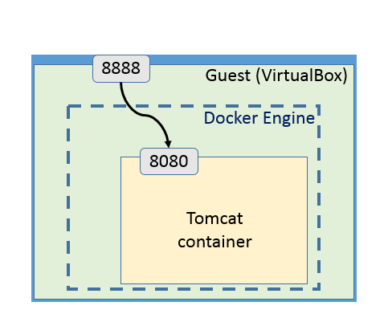
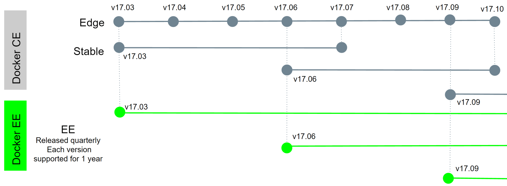
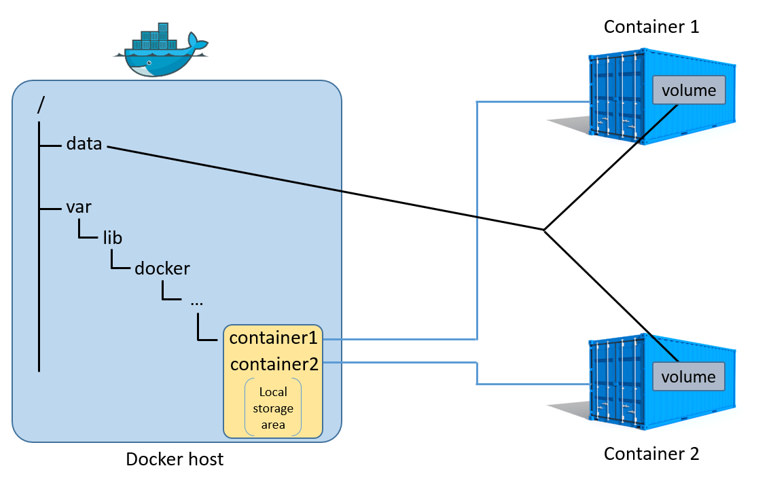
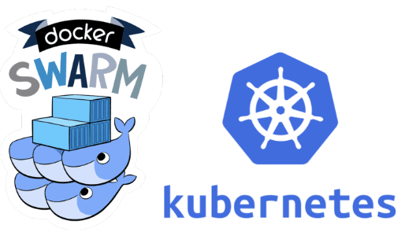
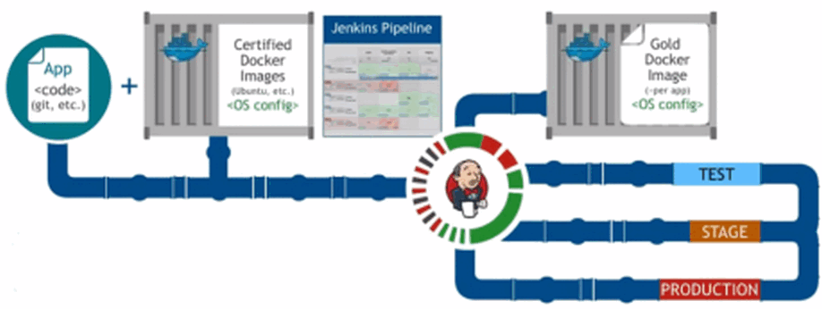

# Docker 2017

## Docker for a Contractor's client

What should you know *before*  
implementing a docker-based solution?

Note:

Context:

You are doing a mission for a client who needs to optimize resources.  
Docker seems a good fit, but do you know what it entails?

- [Docker 2017](#docker-2017)
  - [Docker for a Contractor's client](#docker-for-a-contractors-client)
    - [About Docker](#about-docker)
    - [About this presentation](#about-this-presentation)
    - [About me (Daniel)](#about-me-daniel)
    - [About me (VonC)](#about-me-vonc)
  - [What is Docker](#what-is-docker)
    - [(What) Isolation vs. VM](#what-isolation-vs-vm)
    - [Host vs. Guest](#host-vs-guest)
    - [ContainerD, runc, CNCF, OCI, CRI-O, and Co](#containerd-runc-cncf-oci-cri-o-and-co)
    - [What: Sumary](#what-sumary)
  - [What for/against Docker](#what-foragainst-docker)
    - [Pass, saas, caas, clouds](#pass-saas-caas-clouds)
    - [But: Moving target](#but-moving-target)
    - [Isolation](#isolation)
    - [But: Security](#but-security)
    - [Dev? Ops? DevOps](#dev-ops-devops)
    - [But: Legacy infrastructure & politics, licenses](#but-legacy-infrastructure-politics-licenses)
    - [What for/against: Sumary](#what-foragainst-sumary)
  - [What is beyond Docker](#what-is-beyond-docker)
    - [Persistent volumes](#persistent-volumes)
    - [Orchestration](#orchestration)
    - [Declarative approach (for all)](#declarative-approach-for-all)
    - [What beyond: Sumary](#what-beyond-sumary)
  - [Conclusion](#conclusion)
    - [Training](#training)

---
<!-- .slide: data-background="#030202" -->

### About Docker

- What?
- What for/against?
- What beyond?

+++

### About this presentation

- Available at [github.com](https://github.com/VonC/talks/blob/201710_docker/PITCHME.md)</a>
- Available at [gitpitch.com](https://gitpitch.com/VonC/talks/201710_docker?grs=bitbucket)</a>
- Available at intranet.softeam.com:  
  "[Docker chez un client? Coast Easy!](https://intranet.softeam.fr/node/2943)"
- Fully annotated

Note:

You will find in the shownotes, or directly in the markdown article on GitHub
additional information with each slides.

Palette: <http://paletton.com/#uid=1000u0k004h0jin01bM5n02dm0p>

+++

### About me (Daniel)


**Daniel CHAFFIOL** (Softeam)

- Since 1999
- Development architect
- BNP, SGCIB, HSBC, Amundi

Note:

- Full CV: <https://stackoverflow.com/cv/vonc>

+++

### About me (VonC)


**VonC** (Stack Overflow)

- Since 2008
- 4th all-time user
- Topics: Version Control (Git), Go, Docker

Note:

- Stack Overflow profile: <https://stackoverflow.com/users/6309/vonc>

---
<!-- .slide: data-background="#030202" -->

## What is Docker

- Isolation vs. VM
- Host vs. Guest
- ContainerD, runc, CNCF, OCI, CRI-O, and Co

---
<!-- .slide: data-background="#1b1b1b" -->

### (What) Isolation vs. VM


Note:

Same machine, just isolate itself from file system, CPU, process, memory.

See "Docker containers vs. virtual machines: What’s the difference?" (<https://blog.netapp.com/blogs/containers-vs-vms/>)

+++

#### Isolation vs. VM

- No preemptive resource allocation
- Use of namespaces
- Reuse OS kernel/libs  
  (direct system calls)

#### VM

- Preemptive resource allocation
- OS container
- Use its own OS kernel (Hypervisor)

Note:

That means a Docker container does not have to be an OS
(Ubuntu, Alpine, Debian)  
It can be as simple as

```docker
FROM scratch
COPY myprogram /
ENTRYPOINT myprogram
```

Then `docker build -t myprogram . && docker run -it --rm hello`

See also "CONTAINERS ARE NOT VMS" (<https://blog.docker.com/2016/03/containers-are-not-vms/>)

On VM:

See <https://blog.risingstack.com/operating-system-containers-vs-application-containers/>

VM are also called "OS Containers":

- Meant to be run as an OS, that is run multiple services
- No layered filesystems by default
- Built on cgrougs, namespace , native process resource isolation
- Exemple: LXC, OpenVZ, Linux VServer, BSD Jails, Solaris Zones

During your mission with a client, you will often see both.

+++

#### Ecosystem


Note:

Source <https://docs.microsoft.com/en-us/azure/service-fabric/service-fabric-containers-overview>

---
<!-- .slide: data-background="#5e5e5e" -->

#### (What) Key: you need both

Key: you will need both, almost always.  
That is: isolation within a VM on a machine host.


Note:

And that means determining the level of support offered
by the actual machine host!  
If no support, you are on you own at the next "kernel panic" error message.

See also "CONTAINERS AND VMS TOGETHER" (<https://blog.docker.com/2016/04/containers-and-vms-together/>)

It is rare these days to have a physical machine dedicated to only one instance
of Docker.

1. If there is any security issue, and one local root process escape its
  container, it becomes root on the all server.
2. There is simply too many core/memory for just one service: it is best to
  allocate part of those resources per VM

---
<!-- .slide: data-background="#1b1b1b" -->

### Host vs. Guest

- Docker Guest (container)
- Docker Host (OS or VM)
- Machine Host

+++

#### Docker Guest: your container

Warning: it is *not* an OS


Note:

It is just a collection of files needed for one (ideally) or more
programs to run.  
Beware of the zombie process issue (link Stack Overflow)

+++
<!-- .slide: data-background-transition="none" -->

#### Docker Host: OS or VM

Where is docker installed?

Up to 3 levels!


Note:

Your docker can be installed directly on your machine, or on a VM.


See "How to access tomcat running in docker container from browser?"
(<https://stackoverflow.com/a/27481832/6309>) as an example.

---
<!-- .slide: data-background="#5e5e5e" -->

#### Host vs. Guest Key:  Who is the client

A client want to access a container:  
Where is the final client?

Demo:

```Dockerfile
FROM scratch
COPY hello(.exe) /
ENTRYPOINT ["/hello(.exe)"]
```

---
<!-- .slide: data-background="#1b1b1b" -->

### ContainerD, runc, CNCF, OCI, CRI-O, and Co

In one word: **Architecture** (of Docker)

+++

#### Docker 2013


Note:

Cf. "Diving Through The Layers: Investigating runc, containerd, and the Docker
engine architecture" (<https://www.slideshare.net/PhilEstes/diving-through-the-layers-investigating-runc-containerd-and-the-docker-engine-architecture>)
Phil Estes

From 2013 to early 2015, the binary docker has everything:

- client
- daemon
- build tool
- registry client

+++

#### Docker 2016

Split of the Docker Engine!


Note:

Docker 1.11, April 2016

- containerd: A lightweight daemon for handling container lifecycle:
  gRPC API, simple `ctr` for handling commands.
- containerd-shim: A shim process for holding parent ownership (of a containerd
  process) to allow daemon and containerd to exit/restart without impact.
- runc: the OCI-compliant runtime for executing container processes given
  a filesystem bundle and OCI configuration.

+++

#### Docker 2017 Changes

The year of Moby


Note:

See "Demystifying Moby: From OCI to Linuxkit"
(<http://www.adelzaalouk.me/2017/moby-linuxkit/>) from Adel Zaalouk
(<http://twitter.com/zanetworker>)

Adel explains:

- The OCI is an initiative to define common standards for container frameworks
  to build containers.  
  Container engines such as Docker and rkt provided an easy way to run containers
  by just providing the container image name and the version.
- runC is a container runtime that knows how to deal with OCI defined speicifcations
- Containerd is daemon to manage the complete container lifecycle,
  it abstracts runC details and provides a gRPC compataible API that can be used
  natively or from a command terminal (`ctr`).
- Moby is a project that gathers together all the tools used internally
  by the docker teams and makes it public for developers and contributers to
  share a common repository to innovate.

---
<!-- .slide: data-background="#5e5e5e" -->

#### Docker Architecture Key: modular & interoperable

 > "batteries included but removable"


---

### What: Sumary

- Vm vs. Container (isolation):  
  you need both
- Host vs. Guest:  
  a container make kernel system calls
- Architecture:  
  Modular

---
<!-- .slide: data-background="#030202" -->

## What for/against Docker

- paas, saas, caas, clouds  
  vs. Moving target  

- Isolation  
  vs. Security (VM Network)  

- Dev? Ops? DevOps  
  vs. Legacy


---
<!-- .slide: data-background="#1b1b1b" -->

### Pass, saas, caas, clouds

- Principle
- Hybride
- Serveless

Note:

<https://kinsta.com/blog/google-cloud-vs-aws/>

+++

#### Principle


Note:

References, found in April 2014:

- <https://twitter.com/ivan_curkovic/status/496262057663029248/photo/1>
- "Pizza as a Service - On Prem, IaaS, PaaS, and SaaS Explained through Pie
  (Not Pi)" (<http://www.episerver.com/learn/resources/blog/fred-bals/pizza-as-a-service/>)
  from Fred Bals, whi mentions:

> I was finally able to find the original source, which turned out to be
a LinkedIn post by Albert Barron, a software architect at IBM): <https://www.linkedin.com/pulse/article/20140730172610-9679881-pizza-as-a-service>

Critiques:

"Pizza as-a-Service is Misunderstood" (<http://itknowledgeexchange.techtarget.com/cloud-computing-enterprise/pizza-as-a-service-is-misunderstood/>)
from Brian Gracely (<https://twitter.com/bgracely>)

Applied to Docker, this is mainly about what is provided (by the container) vs.
what you have to manage/install yourself at each upgrade.

+++

#### Where Docker fits in

Container is a mix between IaaS and PaaS


Note:

<https://www.slideshare.net/chanezon/programming-the-world-with-docker>
from Patrick Chanezon.

+++

#### Pizza 2.0 (2017)


Note:

"Pizza as a Service 2.0" (<https://www.linkedin.com/pulse/pizza-service-20-paul-kerrison>)
from Paul Kerrison (<https://www.linkedin.com/in/paulkerrison>)

- **On-Premises** - like a homemade pizza, made from scratch, you do everything
  yourself (no change so far). Example: Datacentre
- **Infrastructure as a Service** - You share a kitchen with others.
  The utilities and oven are provided, but you make and cook the pizza yourself.
  Example: EC2, AVM
- **Containers as a Service** - You bring the pizzas but someone else uses
  their facilities and cooks the pizza for you.
  Example: ECS, ACS
- **Platform as a Service** - You order a pizza for collection,
  the pizzeria make and cook the pizza using their facilities.
  Example: App Engine
- **Function as a Service** - You go to a pizzeria with some friends.
  You order and then eat pizza made by the restuarant.
  You order drinks from the bar and they're made for you.
  Example: AWS Lambda, Azure Functions, Google cloud Functions
- **Software as a Service** - You go to someone's house for a party,
  they provide the pizza and invite others round for you to meet.
  Conversation with the guests is still your responsibility!
  Example: Gmail, O365 Exchange Online

+++

#### Hybride on-premise-cloud


Note:

This is like <https://www.infoq.com/news/2016/02/docker-datacenter-caas>:
some containers on premise, some on the cloud.

This is /not/ "hybrid-cloud" (as described in 2014 in <https://sreeninet.wordpress.com/2014/04/20/hybrid-cloud/>)

It can be consuming services on the cloud while the application remains
on premise: <https://www.ibm.com/blogs/bluemix/2015/06/ibm-containers-a-bluemix-runtime-leveraging-docker-technology/>
or <https://www.ibm.com/blogs/bluemix/2015/06/deploy-containers-premises-hybrid-clouds-ibm-docker/>

Pro vs. Con: <https://www.spiceworks.com/it-articles/iaas-and-saas-vs-onprem/>, <http://rancher.com/devops-containers-prem-cloud/>

#### Serverless

For transient function/application


References:

- <https://www.slideshare.net/BrianChristner/docker-serverless>
- <https://www.contino.io/insights/building-a-serverless-application-with-docker>

---
<!-- .slide: data-background="#5e5e5e" -->

#### Deployment Key: resource sharing

There is always a server:

- goal: optimize resource
- (physical + VM + container)
- even for "serverless"

---

### But: Moving target

- Releases
- Compatibilities (syntax)
- Environments (Cloud)


+++

#### Release: naming change

- Before x.y
- After: 17.04, 17.05...
- stable release every 3 months (03, 06, 09, 12)



Note:

Cf. [My TL;DR: Docker Version/Name Change Highlights](https://www.bretfisher.com/docker-version-name-change-highlights/)
+++

#### Compatibility

- Beware of version
- Dockerfile, compose file, ...


+++

#### Integration (Cloud)

Many environments available:


---
<!-- .slide: data-background="#5e5e5e" -->

#### Moving target Key: Management

You will need to manage:

- the delta
- the wrappers
- the support

---

<!-- .slide: data-background="#1b1b1b" -->

### Isolation

One application per server: not optimal.

- Why
- With VM
- With VM and Containers

Note:

<https://www.slideshare.net/LarryCover/baremetal-docker-containers-and-virtualization-the-growing-choices-for-cloud-applications/>

+++

#### Isolation: why

+++

#### Isolation: with VM

+++

#### Isolation: with VM and Containers

---
<!-- .slide: data-background="#5e5e5e" -->

#### Isolation: Key

- Hardware resources optimization
- Software resources independence
- People resources collaboration

---
<!-- .slide: data-background="#1b1b1b" -->

### But: Security

- Patches
- Broken isolation
- Filesystem


+++

#### Machine: Patches

- ifyou patch the OS, it can break everything
- if you patch the VM, you can break the VM  
  (and its container)


Note:

See also [If it’s in a container it’s secure right ?](https://scottydoesntknow.io/container-secure-right/)

+++

#### Isolation: no root (or root?)

- one line exploit

```Dockerfile
FROM alpine
COPY root.sh /root.sh
CMD ["/bin/bash", "root.sh"]  


root.sh
chroot /hostOS /bin/sh

docker build -t rootplease .
docker run -v /:/hostOS -i -t rootplease
```

@[1-3](Dockerfile)
@[7](Single line: root)
@[10](Access to all files on host)

Note:

- <https://stackoverflow.com/a/34715019/6309>
- <https://github.com/chrisfosterelli/dockerrootplease>
- <https://medium.com/@mccode/understanding-how-uid-and-gid-work-in-docker-containers-c37a01d01cf>

+++

#### Filesystem: uid/gid

Depends on OS Kernel.
Means:

- if escape, root on host
- uid/gid must match between host and image

+++

#### Filesystem: user leakage

Example:

```bash
appxray@/appxray/users/appxray/.jfrog/xray:$ l
total 4.0K
drwxr-xr-x  3 appxray appxray   18 Nov 10 14:45 ..
drwxr-xr-x  5 root    root      44 Nov 13 10:07 mongodb
drwxr-xr-x  3     999 root      42 Nov 13 10:07 rabbitmq
drwxr-xr-x  7 appxray appxray   87 Nov 13 10:07 .
drwxr-xr-x  2    1035    1035  128 Nov 13 10:07 xray-installer
drwxr-xr-x 11    1035    1035  137 Nov 13 10:07 xray
drwx------ 19     999 root    4.0K Nov 13 10:07 postgres
```

@[3](I want to use my account)
@[4](But instead I find root)
@[5,7](or some container-local user id/gid)

---
<!-- .slide: data-background="#5e5e5e" -->

#### Security Key: more administration

- More management (cgroup, userns)
- More control (who access what)
- More audit


---
<!-- .slide: data-background="#1b1b1b" -->

### Dev? Ops? DevOps

It is a culture.


Note:

That is the end goal, but where do you start?

Source: <https://martinfowler.com/bliki/DevOpsCulture.html>

+++

#### Docker Workflow


+++

#### Dev: 2 environments

- Development environment
- Execution environment

But:

- Limit the OS used |
- Trace sudo commands |
- Control the Docker images used |

Note:

Where do you start? On the developer's workstation?.  
Not sure: that is still tricky and requires:

- convincing your Security department
- restricting Docker image access

+++

#### Ops: Execution

Execution Environment...

But also:

- Docker Registry
- ACL (or RBAC) |
- deployment |
- Monitoring |
- Reporting |

Note:

ELK stack 5Elasticsearch, Logstash, Kibana)
Typically Splunk or Centreon for log coll

---
<!-- .slide: data-background="#5e5e5e" -->

#### DevOps Key: Collaboration


Note:

Source: <https://www.pinterest.com/pin/567242515558273751/>

---
<!-- .slide: data-background="#1b1b1b" -->

### But: Legacy infrastructure & politics, licenses

Change is hard.  
You will have to convince:

- Security
- Administrators
- Business

+++

#### Security issues

- Still hard on the developer workstation
- Still tricky on the server side
- Still a lot of questions


Note:

Source: [How to Automate Docker on Vagrant?](http://www.tothenew.com/blog/how-to-automate-docker-on-vagrant/)

+++

#### Administrators

- More management
- More monitoring


+++

#### Business

- ROI
- Better deployment (blue-green, canary release)


Note:

Notions of chain and delivery.

Source: [SECURING THE ENTERPRISE SOFTWARE SUPPLY CHAIN USING DOCKER](https://blog.docker.com/2016/08/securing-enterprise-software-supply-chain-using-docker/)

---
<!-- .slide: data-background="#5e5e5e" -->

#### Change Key: Communication

You will need to present and communicate:

- How you secure the all system?
- How you facilitate the administration?
- How you quicken the TTM (Time To Market)

Note:

- Example: RBAC in Kubernetes. Beware of the LDAP integration.
- Example: portainer.io, Kubernetes dashboard

---

### What for/against: Sumary

- Container as a Service: Between IAAS and PAAS  
  BUT: MOVING TARGET!
- Isolation: Resource optimization/collaboration  
  BUT: SECURITY!
- Dev? Ops? DevOps: Culture change  
  BUT: LEGACY!
  
---
<!-- .slide: data-background="#030202" -->

## What is beyond Docker

- Persistent volumes
- Orchestration (Swarm vs. Kubernetes)
- Declarative approach (for everything)

---
<!-- .slide: data-background="#1b1b1b" -->

### Persistent volumes

- Principle
- stateless vs. stateful
- drivers


Note:

Presentation: [Container Storage Best Practices in 2017 (RedHat)](https://www.slideshare.net/KeithResar/container-storage-best-practices-in-2017)

+++

#### Persistence

- Bind mounts
- Volumes
- tmpfs (in memory)


Note:

Official documentation:

- "[Use bind mounts](https://docs.docker.com/engine/admin/volumes/bind-mounts/)"
- "[Use Volume mounts](https://docs.docker.com/engine/admin/volumes/volumes/)"
- "[Use tmpfs mounts](https://docs.docker.com/engine/admin/volumes/tmpfs/)"

+++

#### Stateless: or not

Copy On Write, but:

- Beware of some configuration/metadata
- in-memory domain state, session
- in-application state


Note:

<https://en.wikipedia.org/wiki/Stateless_protocol>:  
The stateless design simplifies the server design because there is no need to
dynamically allocate storage.

See "The State Of In-Application State: What No One Is Talking About" <https://medium.com/@SeanWalshEsq/the-state-of-in-application-state-what-no-one-is-talking-about-c30392033b08>

First of all, nearly all applications have state, which is more or less just
the current known information about a domain entity.  
State is really a function of what occurs an entity over time.

+++

#### Stateful

Volumes, but:

- needs to be replicated/backup
- needs to support PSI



Note:

See "About images, containers, and storage drivers" <https://docs.docker.com/engine/userguide/storagedriver/imagesandcontainers/>

Presentation: [Storage as microservice (OpenEBS)](https://www.slideshare.net/OpenEBS/docker-chennai-meetup-openebs-overview)

See also "Docker Reference Architecture:
Design Considerations and Best Practices to Modernize Traditional Apps (MTA)" <https://success.docker.com/article/Docker_Reference_Architecture-_Design_Considerations_and_Best_Practices_to_Modernize_Traditional_Apps_(MTA)_with_Docker_EE>

+++

#### Drivers

DVDI: Docker Volume Drive Interface

- to be benchmarked
- to be managed (upgrade/rollback)


Note:

As of Docker 1.7, there was a Volume Driver API defined that allows Docker to work
with external storage providers.  
The API documentation is available here: <https://github.com/docker/docker/blob/master/docs/extend/index.md>

Study: [Container Storage Architectures: How Does Kubernetes, Docker, and Mesos Compare?](https://blog.thecodeteam.com/2017/06/27/container-storage-architectures-kubernetes-docker-mesos-compare/)

Example: [Docker 1.12.1 Swarm Mode & Persistent Storage with DellEMC RexRay](http://collabnix.com/docker-1-12-1-swarm-mode-persistent-storage-with-dellemc-rexray/)

---
<!-- .slide: data-background="#5e5e5e" -->

#### Persistent volumes Key: compare

- Depends on the nature of the application
- Depends on the IO throughput
- Depends on the stability

---
<!-- .slide: data-background="#1b1b1b" -->

### Orchestration

Orchestration:

- Swarm
- Kubernetes
- Now fully integrated?



Note:

Source: <http://www.apiacademy.co/resources/api-management-302-using-an-api-gateway-in-microservice-architecture/>

<https://www.slideshare.net/DanilvanGils/how-do-i-run-microservices-in-production-using-docker>

From <https://www.slideshare.net/Dev_Events/building-next-gen-applications-and-microservices>

- Containers:
  - Encapsulates services and are accessible by IP/port combination
- Service Discovery:
  - Provide a way to know when Services have been added/removed and where they
      are located.
- Service Orchestration:
  - Manages Service Topologies
  - Ensures availability and utilization
- API Gateway:
  - Security
  - Routing

#### Orchestration Principle


#### Orchestration elements


Source: [Democratizing orchestration with Docker](https://blog.jayway.com/2016/06/20/docker-1-12-orchestration/)

#### Orchestration Key: another system

- On top of docker, you need to monitor the orchestrator
- That has an impact on your architecture
- and you need to secure your persistence

See also "Kubernetes vs Docker Swarm vs DC/OS: May 2017 Orchestrator Shootout" (<https://www.linkedin.com/pulse/kubernetes-vs-docker-swarm-dcos-may-2017-orchestrator-arvind-soni>)

+++

#### Swarm


Note:

Source: <https://thenewstack.io/containers-container-orchestration/>

Swarm alone:

- Gets you started
- Invisible

+++

#### Kubernetes


Note:

Source: <https://thenewstack.io/containers-container-orchestration/>

Kubernetes alone

- More complex
- More complete
- More notions

---
<!-- .slide: data-background="#5e5e5e" -->

#### Swarm vs. Kubernetes Key: Kubernetes

- Probably the safest choice because it will cover every scenario
- but still under heavy evolutions


Note:

See "DockerCon Europe 2017: Docker EE and CE to Include Kubernetes Integration" (<https://www.infoq.com/news/2017/10/docker-kubernetes-integration>)
from  Daniel Bryant (<https://twitter.com/danielbryantu>)

- only since 17.10
- result of CRI-O and CNCF
- so not always available

---
<!-- .slide: data-background="#1b1b1b" -->

### Declarative approach (for all)

- Trend
- Why: ownership
- Declarative vs. prescriptive


+++

#### Trend

- Build: Maven (pom.xml)
- Compilation: Jenkins 2.x (jenkinsfile)
- Integration: Docker Compose (docker-compose.yml)
- Deployment: Kubernetes (deploy.yaml)



+++

#### Why: Ownership

Those (pom.xml, jenkinsfile, yaml) are text file, which means:

- they are versioned
- they are auditable
- they are independent


Note:

Typically, if Jenkins goes in flame, you just restart a new Jenkins
and can re-declare your job by pointing at the repository which
includes your jenkinsfile.  
The same can by said of Docker or Kubernetes.

+++

#### Declarative vs. Prescriptive

- Declarative: maven, Jenkins, Dockerfile
- Prescriptive: swarm, Kubernetes
- Mechanics vs. Dynamics.

Note:

 > ‘declarative’ in that they describe WHAT it is you’re trying to provision  
 > (as opposed to ‘prescriptive’ models that describe HOW you’re going to get there).

- Descriptive means: if something breaks, the all process fails and stop
- Prescriptive means: if something breaks, the system tries its hardest
  to restore its state to a prescribed optimal one.

 vs.
 vs.

---
<!-- .slide: data-background="#5e5e5e" -->

#### Declarative approach Key: the future

- You can "read" what you want to do
- You don't depend on a running system


---

### What beyond: Sumary

- Peristence:  
  Volume Drivers are evolving
- Orchestrators:  
  Docker Swarm vs. Kubernetes
- Descriptive or Prescriptive:  
  text file, better ownership

---
<!-- .slide: data-background="#030202" -->

## Conclusion

Not a new idea:

- What: Isolation because resource optimization |
- What for: Devops means more collaboration, quicker TTM |
- What against: Change and Security management |
- What beyond: Ownership (data, process) |

+++

But remember: A lot to manage!


Note:

Image from <http://lakehub.co.ke/2016/01/08/docker-calendar-q1/>

---
<!-- .slide: data-background="#1b1b1b" -->

### Training

- Don't install anything
- Online only
- For Docker, Swarm, Kubernetes!

+++

#### Docker Training

Play with Docker: [play-with-docker.com](https://labs.play-with-docker.com/)

<a href="https://labs.play-with-docker.com/" alt="Play with Docker">

</a>

+++

#### Moby Training

Play with Moby: [play-with-moby.com](https://labs.play-with-docker.com/)

<a href="http://play-with-moby.com/" alt="Play with Moby">

</a>

+++

#### Swarm Training

Katacoda Swarm: [www.katacoda.com](https://www.katacoda.com/courses/docker-orchestration/getting-started-with-swarm-mode)

<a alt="Katacoda Swarm" href="https://www.katacoda.com/courses/docker-orchestration/getting-started-with-swarm-mode">

</a>

+++

#### Kubernetes Training

Play with Kubernetes: [play-with-k8s.com](http://play-with-k8s.com)

<a href="http://play-with-k8s.com" alt="Play with Kubernetes">

</a>

Actually redirect to PWD! (Since K8s is integrated)

Note:

<https://medium.com/@marcosnils/introducing-pwk-play-with-k8s-159fcfeb787b/>

+++

#### My-Mooc K8s Training

My Mooc: [www.my-mooc.com](https://www.my-mooc.com/en/moocs?filter%5Bsearch%5D=kubernetes&filter%5Bfrom%5D=home)

<a alt="My Mooc K8s" href="https://www.my-mooc.com/en/moocs?filter%5Bsearch%5D=kubernetes&filter%5Bfrom%5D=home">

</a>

+++

#### Docker Events

Docker Events: **[events.docker.com](https://events.docker.com/)**

<a href="https://events.docker.com/" alt="Docker Events!">

</a>