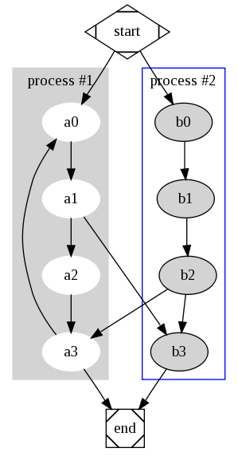

# Go Profilling

Performance profiling

Note:

- [Go Profilling](#go-profilling)
  - [Plan](#plan)
    - [About this presentation](#about-this-presentation)
    - [About me (Daniel)](#about-me-daniel)
    - [About me (VonC)](#about-me-vonc)
  - [Why Profiling](#why-profiling)
    - [For testing (static)](#for-testing-static)
    - [For reporting (runtime)](#for-reporting-runtime)
    - [For Measuring (runtime)](#for-measuring-runtime)
  - [Performance profiling](#performance-profiling)
    - [Example: Julia Set](#example-julia-set)
    - [Tools (benchmark, pprof)](#tools-benchmark-pprof)
    - [Problem](#problem)
  - [Event-based profiling](#event-based-profiling)
    - [Tracer](#tracer)
    - [Goroutine vs. GC](#goroutine-vs-gc)
    - [Trade-off](#trade-off)
  - [Conclusion](#conclusion)

---
<!-- .slide: data-background="#030202" -->

## Plan

- Why Profiling
- What: Performance Profiling
- How: Event-based Profiling

+++

### About this presentation

- Available at [github.com](https://github.com/VonC/talks/blob/2018_goprofiling/PITCHME.md)</a>
- Available at [gitpitch.com](https://gitpitch.com/VonC/talks/2018_goprofiling?grs=github)</a>
- Available at intranet.softeam.com:  
  "[Go Fractal, no bugs!!](https://intranet.softeam.fr/node/2904)" (Oct. 2017)
- Fully annotated

Note:

You will find in the shownotes, or directly in the markdown article on GitHub
additional information with each slides.

Palette: <http://paletton.com/#uid=1000u0k004h0jin01bM5n02dm0p>

+++

### About me (Daniel)


**Daniel CHAFFIOL** (Softeam)

- Since 1999
- Development architect
- BNP, SGCIB, HSBC, Amundi

Note:

- Full CV: <https://stackoverflow.com/cv/vonc>

+++

### About me (VonC)


**VonC** (Stack Overflow)

- Since 2008
- 4th all-time user
- Topics: Version Control (Git), Go, Docker

Note:

- Stack Overflow profile: <https://stackoverflow.com/users/6309/vonc>

---?image=assets/img/report-test-measure.jpg&size=auto 90%
<!-- .slide: data-background="#030202" -->

## Why Profiling

- For Testing  
  or:
- For Reporting
- For Measuring

Note:

What is profiling?

3 kinds of profiling ("Performance Profiling" <http://thomas-solignac.com/blog/slides-talk-05-11-2017-performance-profiling/>
from Thomas Solignac <https://twitter.com/thomassolignac?lang=en>)

Image: <https://www.google.com/search?q=testing+reporting+measuring&client=firefox-b-ab&tbm=isch&tbs=rimg:Cc_1GCKcUsN5SIjiYLCvz1yy1Y7G-HNTf9ScDz2PBuawRGyrqARrgEERML5KstypjjauJT-tublrNDVxPvpvbDLiOyyoSCZgsK_1PXLLVjEcz4ApKACDT6KhIJsb4c1N_11JwMRmHQM62jKPvYqEgnPY8G5rBEbKhHXUot4qu17fyoSCeoBGuAQREwvEdi-BaFNW2VRKhIJkqy3KmONq4kRq8swlMDQ5R0qEglP625uWs0NXBFIwQmglQGuaSoSCU--m9sMuI7LEaBWLHZrxket&tbo=u&sa=X&ved=0ahUKEwiF5ei84ebZAhWE3KQKHSsACMQQ9C8IHA&biw=1600&bih=795&dpr=1#imgrc=z8YIpxSw3lIMgM:>

+++

### For testing (static)


- Code Profiling
  - Dependencies
  - Code qualities (linters)
  - Call Graph

Note:

Testing techniques are numerous with Go: <https://speakerdeck.com/mitchellh/advanced-testing-with-go>
(Mitchell Hashimoto: <https://twitter.com/mitchellh>)

Regarding dependencies:

Project **golang/dep** (<https://github.com/golang/dep>)
from **Sam Boyer** (<https://twitter.com/sdboyer>).
See "**So you want to write a package manager**" (<https://medium.com/@sdboyer/so-you-want-to-write-a-package-manager-4ae9c17d9527#.740o43vxi>)

```bash
dep init
dep ensure
dep status -v
```

That help keeping only the dependencies you are actually using!  
See for instance <https://twitter.com/tvii/status/968849694012137473>

But don't forget the official project vgo,
which might end up superseeding go dep: <https://github.com/golang/go/wiki/vgo>

+++

### For reporting (runtime)


- Services continuous monitoring
  - Availability
  - Latency
  - EventLog

+++

### For Measuring (runtime)


- Performance profiling
  - CPU
  - Memory

Note:

But it does not stop here:

- **Code coverage**: package by package, or (with the Go 1.10,
  for the all project: <https://github.com/golang/go/issues/16768>)
- See "Building and using coverage-instrumented programs with Go (<http://damien.lespiau.name/2017/05/building-and-using-coverage.html>)
  from DAMIEN LESPIAU (<https://twitter.com/__damien__>)

---

## Performance profiling

APM  
(Application Performance Management)


- Statistical
- Event-based

Note:

2 big categories within APM Application Performance Management (<https://en.wikipedia.org/wiki/Application_performance_management>)

<https://en.wikipedia.org/wiki/Profiling_(computer_programming)>

<https://www.raymond.cc/blog/measure-time-taken-to-complete-a-batch-file-or-command-line-execution/>
<https://code.google.com/archive/p/time-windows/source/default/source>
<https://github.com/golang/benchmarks/blob/master/driver/driver_windows.go>

+++?image=assets/img/julia1.png&size=auto 90%

### Example: Julia Set

([Wikipedia](https://en.wikipedia.org/wiki/Julia_set))

Quadratic mapping:

$$z_{(n+1)}=z_n^2 + c$$

Note:

Cf. "**Understanding Julia and Mandelbrot Sets**" (<http://www.karlsims.com/julia.html>)
by **Karl Sims** (<http://www.karlsims.com/>)

Cf. "Wolfram MathWorld: Julia Set" (<http://mathworld.wolfram.com/JuliaSet.html>)
+++

#### Iterations


+++

#### Code Julia

```go
// InJulia checks if complex number c is in Julia z0 set
func InJulia(z0, c complex128, n float64) (bool, float64) {
  z := z0
  for i := float64(0); i < n; i++ {
    z = z*z + c
    if cmplx.Abs(z) > 2 {
      return false, i
    }
  }

  return true, n
}
```

@[4-6](Mathematical part)

Note:

Based on code from <https://github.com/sfluor/fractcli>, authored
by **Salph Tabet** (<https://github.com/sfluor>)
It uses also <https://github.com/lucasb-eyer/go-colorful>, a library for playing
with colors in go (golang), by **Lucas Beyer** (<http://lucasb.eyer.be/>).

+++

#### Code Loop

```go
func fillImage(img *image.RGBA, c complex128) {

  mapColors := constructColorMap(limit, true)

  for x := float64(0); x < size; x++ {
    for y := float64(0); y < size; y++ {
      _, gap := InJulia(complex(3*x/size-1.5, 3*y/size-1.5), c, limit)
      r, g, b := mapColors(gap)
      // Set the color of our pixel
      img.Set(int(x), int(y), color.RGBA{r, g, b, 255})
    }
  }
}
```

@[5-7](Done for each pixel of the image)
@[8-10](Colorize and fill the image)

Note:

Main example: "**Using the Go execution tracer to speed up fractal rendering**" (<https://medium.com/@francesc/using-the-go-execution-tracer-to-speed-up-fractal-rendering-c06bb3760507>,
<https://campoy.cat/blog/using-the-go-tracer-to-speed-up-fractal-making/>)
from **Francesc Campoy** (<https://twitter.com/francesc>):

- His code is at <https://github.com/campoy/justforfunc/tree/master/22-perf>
- And a video demonstration is available at <https://www.youtube.com/watch?v=ySy3sR1LFCQ&feature=youtu.be&list=PL6>

---

### Tools (benchmark, pprof)

- benchmark
- comparison
- pprof

+++

#### benchmark code

```go
func Benchmark_createImageSimple(b *testing.B) {
  c := complex(0.312, 0.5)
  flagfill = true
  for i := 0; i < b.N; i++ {
    createImage(size, limit, c)
  }
  flagfill = false
}
```

@[1](Benchmark function)
@[4-5](Loop for at least 1 second)

Note:

See "How to write benchmarks in Go" from Dave Cheney
<https://dave.cheney.net/2013/06/30/how-to-write-benchmarks-in-go>

+++

#### benchmark test

    go test -bench=Simple

    Result:

```bash
> go test -bench=Simple
goos: windows
goarch: amd64
pkg: julia_raw
Benchmark_createImageSimple-4           20       96912305 ns/op
PASS
ok      julia_raw       2.301s
```

Note:

On understanding/improving benchmark format!

- <https://github.com/golang/proposal/blob/master/design/14313-benchmark-format.md>
- <https://github.com/cespare/prettybench>

+++

#### benchmarkcmp

    go get -u golang.org/x/tools/cmd/benchcmp

Note:

Time is monotonic since Go 1.9:  
<https://github.com/golang/proposal/blob/master/design/12914-monotonic.md>

See "Analyzing benchmarks with ease using benchcmp and benchviz Golang" (<https://medium.com/@hackintoshrao/analyzing-benchmarks-with-ease-using-benchcmp-and-benchviz-golang-add607fc46d6>)

#### Graph

For the graphic GUI version of profiling, You will need:

"**Graphviz - Graph Visualization Software**"  
  (<https://graphviz.gitlab.io>)  
  Windows Packages: <https://graphviz.gitlab.io/_pages/Download/Download_windows.html>



+++

#### pprof CPU

```go
  if flagPCPU {
    defer profile.Start(profile.CPUProfile, profile.ProfilePath("."), profile.NameProfile(name)).Stop()
  }

julia_raw.exe -fill -pcpu  

go tool pprof -http=8080 cpu.pprof
```

@[1-3](Instrumentalisation)
@[5](Generation)
@[7](Utilization)

(demo)

Note:

Profiling: it is even better with the Go 1.10: "The new pprof user interface"  
(<https://rakyll.org/pprof-ui/>) from Jaana Burcu Dogan (JBD), aka @rakyll (<https://twitter.com/rakyll>)

Profiler pprof "**Go Profiler Internals**" (<https://stackimpact.com/blog/go-profiler-internals/>)
from **Dmitri Melikyan** (<https://github.com/dmelikyan>)
founder of **StackImpact** (<https://twitter.com/stackimpact>).

See also "**Profiling Go**" <http://www.integralist.co.uk/posts/profiling-go/>
from **Mark McDonnell** (<https://twitter.com/integralist>)

It is a bit of an hassle to trigger the profiling, redirecting its output to a file
(see <https://groups.google.com/forum/#!topic/golang-nuts/YhnyJDI3IG0>).
But you have "**pkg/profile**" (<https://github.com/pkg/profile>) from **Dave Cheney**
(<https://github.com/davecheney>, <https://dave.cheney.net/>, <https://twitter.com/davecheney>)

+++

#### pprof alternative

```go
go get -u github.com/google/pprof

pprof.exe -http=:8080 cpu.pprof
```

With flamegraph!


Note:

See "**PROFILING GO APPLICATIONS WITH FLAMEGRAPHS**" (<http://brendanjryan.com/golang/profiling/2018/02/28/profiling-go-applications.html>)"
from **Brendan Ryan** (<https://twitter.com/brendan_j_ryan>) for the Uber approach
to flamegraph.

But this approach has now been superseded with the alternative `pprof` tool,
with flamegraph support.

+++

### Problem

Statistical approach leads to...  
optimize math???


Note:

With pprof, only what is executed, each time we are asking the program.

See also Abs.Cplx  
"An adventure in trying to optimize math.Atan2 with Go assembly": <http://agniva.me/go/2017/08/27/fun-with-go-assembly.html>

---

## Event-based profiling

- tracer
- goroutine
- trade-off

+++

### Tracer

```go
  if flagPTrace {
    defer profile.Start(profile.TraceProfile, profile.ProfilePath("."), profile.NameProfile(name)).Stop()
  }

julia_raw.exe -fill -ptrace

go tool trace -http=:8080 trace.pprof
```

@[1-3](Instrumentalisation)
@[5](Generation)
@[7](Utilization)

Note:

Tracer (hooks)

See also <https://medium.com/@cep21/using-go-1-10-new-trace-features-to-debug-an-integration-test-1dc39e4e812d>

+++?image=assets/img/trace_simple.png&size=auto 90%

#### Resultat

---

### Goroutine vs. GC

Goroutines!

+++

#### Goroutine First approach: Code

One goroutine per pixel!!!

```go
func fillImagePixel(img *image.RGBA, c complex128) {
  var w sync.WaitGroup
  w.Add(size * size)
  for x := float64(0); x < size; x++ {
    for y := float64(0); y < size; y++ {
      go func(i, j float64) {
          ...
          w.Done()
      }(x, y)
    }
  }
  w.Wait()
```

@[4-5](For every pixel)
@[6-9](Call a lambda, assynchronously)

+++?image=assets/img/trace_pixel.png&size=auto 90%

#### Goroutine First approach: Result

+++

#### Goroutine Second approach: Code

One goroutine per row!

```go
func fillImageCol(img *image.RGBA, c complex128) {

  var w sync.WaitGroup
  w.Add(size)
  for x := float64(0); x < size; x++ {
    go func(i float64) {
      for y := float64(0); y < size; y++ {
        ...
      }
      w.Done()
    }(x)
  }
  w.Wait()
}
```

@[5](For every row)
@[6-7](Call a lambda, assynchronously)
@[4,10](Adjust WaitGroup size)

+++?image=assets/img/trace_row.png&size=auto 90%

#### Goroutine Second approach: Result

+++

### Trade-off

- Statistic vs. Events
- concurrency vs. parallelism
- Process vs. GC

Note:

"Modern garbage collection: A look at the Go GC strategy" <https://blog.plan99.net/modern-garbage-collection-911ef4f8bd8e>
by Mike Hearn (Dec. 2016):  
GC is made to optimise for pause times at the cost of absolutely every other
desirable characteristic in a GC.

"Go channels are bad and you should feel bad" by JT Olio
(<https://www.jtolio.com/2016/03/go-channels-are-bad-and-you-should-feel-bad/>,
<https://news.ycombinator.com/item?id=11210578>)  
 communicating sequential processes (CSP)  (<https://en.wikipedia.org/wiki/Communicating_sequential_processes>)
 cannot answer all cases.

## Conclusion

Go is worth exploring.

- GoDoc
- Static code analysis (linters)
- Built-in testing and profiling framework
- Race condition detection

Notes:

"Here are some amazing advantages of Go that you don’t hear much about"
<https://medium.freecodecamp.org/here-are-some-amazing-advantages-of-go-that-you-dont-hear-much-about-1af99de3b23a>

"Why Go?": <https://hackernoon.com/why-go-ef8850dc5f3c>

"What’s changes in Golang 1.10": <https://medium.com/@thuc/whats-changes-in-golang-1-10-d3022fbade3c>